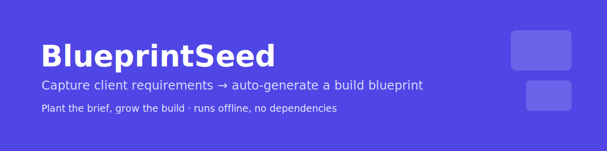
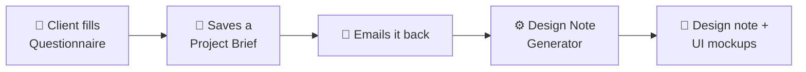

  

<h1 align="center">Website Project Toolkit</h1>

  A reusable, white-label quick-start for web &amp; app projects: capture a client's requirements, then auto-generate a build-team design note — complete with UI wireframes for every screen.

  
  
  

---

## What it is

Two self-contained HTML files that turn a messy, error-prone kick-off into a repeatable, professional process:

1. A **client questionnaire** that captures *what* they need — in plain language.
2. A **design-note generator** that turns those answers into *how we'll build it* — architecture, scope, compliance, roadmap, and screen mockups — for the project team.

No installs, no accounts, no internet required. Open in any browser.

## How it works

The questionnaire embeds the answers invisibly in the saved file; the generator reads that file and produces the note — nothing is re-typed.

## The two tools

| Tool | For | What it does |
|------|-----|--------------|
| 📝 **[Website-Project-Questionnaire.html](Website-Project-Questionnaire.html)** | The client | A friendly, step-by-step wizard that adapts to the project type, auto-saves progress, and shows plain-language tax/legal must-haves based on the answers. Exports a *Project Brief* to email back. |
| ⚙️ **[Design-Note-Generator.html](Design-Note-Generator.html)** | The project team | Reads the client's answers and generates a tailored design note: architecture, data model, fulfillment, inventory, payments, **compliance**, **roadmap**, a **screen inventory with wireframe mockups**, and **client sign-off gates**. Exports HTML / PDF / Markdown. |

## Why it matters

- **Fewer surprises.** Scope and must-haves are explicit before a line of code.
- **Mockup-first.** Every screen is wireframed up front — clients react and approve early, when changes are cheap.
- **Compliance built in.** Tax, privacy, and sector rules are flagged automatically from the answers.
- **Repeatable.** The same solid foundation for every new client.

## Try it

1. Download or clone this repo.
2. Open **`Website-Project-Questionnaire.html`**, fill a few steps, and save your answers.
3. Open **`Design-Note-Generator.html`**, load that file, and click **Generate**.

## Notes

- White-label and neutral — brand it per engagement.
- The built-in design rules reflect a production-grade reference architecture (modular, marketplace-ready, ERP-grade inventory, India-first compliance, mockup-first sign-off).
- Both tools are versioned in-file and evolve as the approach matures.

---

Built by ajainx3 · 🤖 with <a href="https://claude.com/claude-code">Claude Code</a>

